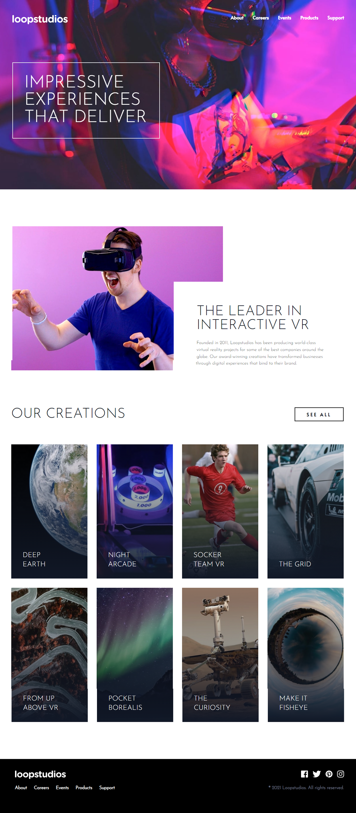

# Loop Studios

An advanced creative studio website showcasing sophisticated design patterns, complex layouts, and professional web development techniques using Tailwind CSS.

## 📸 Project Screenshot



## 📝 Description

Loop Studios is a creative agency/digital studio website that demonstrates advanced web design and development. It features a portfolio showcase, service offerings, and a modern design aesthetic. The site emphasizes visual storytelling and professional presentation with high-quality imagery and smooth interactions.

## ✨ Features

- **Portfolio Gallery** - Showcase of creative work with both desktop and mobile layouts
- **Service Offerings** - Detailed service descriptions
- **Team Section** - Staff and expertise showcase
- **Case Studies** - In-depth project examples
- **Contact Information** - Multiple contact methods
- **Newsletter Signup** - Email collection
- **Advanced Animations** - Smooth transitions and effects
- **Mobile and Desktop Views** - Optimized media assets

## 🛠️ Technologies Used

- **HTML5** - Semantic and well-structured markup
- **Tailwind CSS** - Advanced utility-first styling
- **JavaScript (ES6+)** - Complex interactivity
- **CSS Grid** - Advanced layout techniques
- **CSS Flexbox** - Component alignment
- **Responsive Images** - Desktop and mobile variants
- **SVG** - Scalable vector graphics

## 📂 Project Structure

```
loop-studios/
├── index.html              # Main HTML file
├── input.css              # Source CSS with Tailwind directives
├── package.json           # Project dependencies
├── tailwind.config.js     # Tailwind configuration
├── css/
│   └── style.css          # Compiled Tailwind CSS
├── js/
│   └── script.js          # Interactive functionality
└── images/
    ├── desktop/           # Desktop image assets
    └── mobile/            # Mobile optimized images
```

## 🚀 Getting Started

### Installation

1. Navigate to the project folder:

   ```bash
   cd loop-studios
   ```

2. Install dependencies:

   ```bash
   npm install
   ```

3. Start the development server:
   ```bash
   npm run watch
   ```

### Usage

1. Open `index.html` in your web browser
2. Explore the portfolio and services sections
3. Test responsive behavior on different devices
4. Interact with portfolio items and animations

## 📋 Page Sections

- **Header/Navigation** - Branding and responsive menu
- **Hero Section** - Impressive visual introduction
- **Portfolio/Works Section** - Gallery of creative projects
- **Services Offered** - Detailed service listing
- **About/Team** - Company information and staff
- **Client Testimonials** - Social proof and success stories
- **Case Studies** - In-depth project breakdowns
- **Contact Section** - Multiple contact options
- **Footer** - Navigation links and company info

## 🎨 Advanced Design Features

- **Image Optimization** - Separate desktop/mobile images
- **Grid Layouts** - Multi-column portfolio displays
- **Hover Effects** - Interactive element states
- **Responsive Typography** - Scaling text for devices
- **Visual Hierarchy** - Clear content prioritization
- **White Space** - Professional spacing
- **Brand Consistency** - Unified design language

## 🎯 Learning Opportunities

By studying this project, you'll master:

- Advanced CSS Grid techniques
- Responsive image implementation
- Complex component structures
- JavaScript event handling
- Animation and transition design
- Professional design patterns
- Portfolio website best practices
- Media query optimization

## 🔗 Resources

- [Tailwind CSS Documentation](https://tailwindcss.com/)
- [MDN - CSS Grid](https://developer.mozilla.org/en-US/docs/Web/CSS/CSS_Grid_Layout)
- [MDN - Responsive Images](https://developer.mozilla.org/en-US/docs/Learn/HTML/Multimedia_and_embedding/Responsive_images)
- [Web Design Trends](https://www.awwwards.com/)

## 💡 Enhancement Ideas

- Add image lazy loading
- Implement lightbox/modal gallery
- Add portfolio filtering by category
- Create animated counters for statistics
- Add testimonial carousel
- Implement contact form with validation
- Add loading animations
- Create scroll-triggered animations

## 🖼️ Image Management

### Desktop Images

Located in `images/desktop/`

- High resolution for large screens
- Full detail and clarity
- Larger file sizes acceptable

### Mobile Images

Located in `images/mobile/`

- Optimized for smaller screens
- Faster loading times
- Appropriate aspect ratios

### Best Practices

- Use next-gen formats (WebP with fallbacks)
- Implement srcset for responsive images
- Optimize file sizes
- Consider lazy loading

## 📱 Responsive Design

Optimized breakpoints:

- **Mobile First** (320px - 639px)
- **Tablet** (640px - 1023px)
- **Desktop** (1024px - 1279px)
- **Large Screens** (1280px+)

## 🔧 Customization

### Branding

1. Update logo in header
2. Modify primary colors in `tailwind.config.js`
3. Update font selections
4. Adjust spacing scale

### Portfolio Content

1. Replace portfolio images
2. Update project descriptions
3. Modify project links/CTAs
4. Customize portfolio categories

### Services

1. Edit service descriptions
2. Add/remove service items
3. Update icons and visuals
4. Adjust pricing or details

## 📊 Performance Tips

- Optimize all images for web
- Minify CSS and JavaScript
- Consider image compression tools
- Implement caching strategies
- Test on various devices
- Monitor Core Web Vitals

## 📝 Notes

- This is a static website template
- Backend integration needed for contact forms
- Analytics can be easily added
- CDN recommended for image delivery
- Consider SEO optimization

## 🚀 Deployment Options

- Vercel (recommended for performance)
- Netlify
- GitHub Pages
- AWS S3 + CloudFront
- Traditional web hosting

---

**Back to [Main README](../README.md)**
